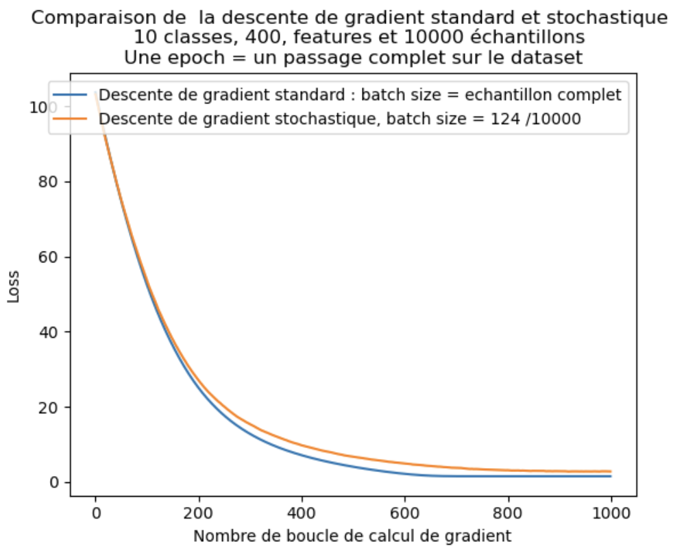

### This repo is a study of the application of stochastic gradient descent to a small neural network.

Let's consider a classification problem with $m$ classes and $m$ parameters, which we want to process using a basic neural network consisting of a linear layer to which we apply softmax. The figure below shows the corresponding graphcite{https://towardsdatascience.com/deep-dive-into-softmax-regression-62deea103cb8}

 
 
     Graphe du réseau de neurones[1].

We begin by defining the cross entropy loss function:
$ \mathcal{L}=\mathcal{L}_{\operatorname{CrossEntropy}} -\sum_{t=1}^k y_t \log \hat{y}_t $
avec (softmax):
 $\hat{y}_t = \frac{e^{z_t}}{\sum_{p=1}^k e^{z_p}}$

Using the chain rule, we obtain $\forall (i,j) \in (\lbrace 1,...,k \rbrace )\times (\lbrace 1,...,m\rbrace) $ : 

$$ \frac{\partial \mathcal{L}}{\partial w_{ji}} = \frac{\partial \mathcal{L}}{\partial z_i} \frac{\partial z_i}{\partial w_{ji}} $$
et 
$$ \frac{\partial \mathcal{L}}{\partial b_i} = \frac{\partial \mathcal{L}}{\partial z_i} \frac{\partial z_i}{\partial b_i} $$

À partir de la définition de l'unité de pré-activation '$ z_i =x_j w_{ji} + b_j $', nous obtenons :
$$ \frac{\partial z_i}{\partial w_{ji}} = x_j $$

$$ \frac{\partial z_i}{\partial b_{i}} = 1 $$

Calculons maintenant $ \frac{\partial \mathcal{L}}{\partial z_i} $. Cette expression est un peu plus délicate à calculer car $ z_i $ ne contribue pas seulement à $ \hat{y}_i $ mais à tous $ \hat{y}_k $ en raison du terme de normalisation $ (\sum_t e^{z_{t}}) $ dans $ \hat{y}_k = \frac{e^{z_k}}{\sum_t e^{z_t}} $.

$$ \frac{\partial \mathcal{L}}{\partial z_i} = \frac{\partial \mathcal{L}}{\partial \hat{y}_i} \frac{\partial \hat{y}_i}{\partial z_i} + \sum_{t \neq i}^k \frac{\partial \mathcal{L}}{\partial \hat{y}_t} \frac{\partial \hat{y}_t}{\partial z_i} $$

Le gradient de la perte par rapport à la sortie $ \hat{y}_i $ est :
$$ \frac{\partial \mathcal{L}}{\partial \hat{y}_i} = -y_i \frac{1}{\hat{y}_i} $$

Calculons maintenant $ \frac{\partial \hat{y}_i}{\partial z_i} $ en utilisant la définition de la fonction softmax :

$$ \frac{\partial \hat{y}_i}{\partial z_i} = \hat{y}_i (1 - \hat{y}_i) $$

Pour $ t \neq i $, le gradient par rapport à $ z_i $ est :
$$ \frac{\partial \hat{y}_t}{\partial z_i} = -\hat{y}_t \hat{y}_i $$

Remplaçons les résultats ci-dessus :
$$ \frac{\partial \mathcal{L}}{\partial z_i} = -y_i \hat{y}_i (1 - \hat{y}_i) + \sum_{t \neq i} -y_t \hat{y}_t \hat{y}_i $$

Simplifions davantage :
$$ \frac{\partial \mathcal{L}}{\partial z_i} = -y_i + y_i \hat{y}_i + \sum_{t \neq i} y_t \hat{y}_i $$

$$ \frac{\partial \mathcal{L}}{\partial z_i} = \hat{y}_i \left( \sum_t y_t \right) - y_i $$

Finalement, nous obtenons le gradient par rapport à $ w_{ji} $ :
$$ \frac{\partial \mathcal{L}}{\partial w_{ji}} = x_j (\hat{y}_i - y_i) $$
et donc $$\nabla \mathcal{L}_\textbf{W}=\textbf{X}^\top(\mathbf{\hat{y}} - \mathbf{y})$$

Enfin, en se rappelant que $$ \frac{\partial z_i}{\partial b_i}=1$$  il vient $$ \nabla \mathcal{L}_{\mathbf{b}} = \mathbf{I}^\top(\mathbf{\hat{y}} - \mathbf{y})$$

This gives the gradient of the cross-entropy loss with respect to the linear network weights, followed by the softmax function for all observations.
We can now use our gradient descent algorithms to refine our neural network.

To find out more, open the .ipynb file.

